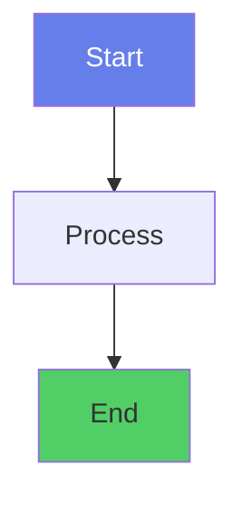

# Python Machine Learning Course - Style Guide

## Overview
This style guide ensures consistency across all course materials, providing a professional and cohesive learning experience.

## File Structure

### HTML Template
All lesson files should follow this consistent structure:

```html
<!DOCTYPE html>
<html lang="en">
<head>
    <meta charset="UTF-8">
    <meta name="viewport" content="width=device-width, initial-scale=1.0">
    <meta name="description" content="[Lesson description for SEO]">
    <title>[Lesson Title] - Python Machine Learning</title>
    <link rel="stylesheet" href="styles/main.css">
    <link rel="stylesheet" href="styles/enhanced.css">
    <link rel="icon" href="/favicon.png" type="image/png">
    <script type="module">
      import mermaid from 'https://cdn.jsdelivr.net/npm/mermaid@10/dist/mermaid.esm.min.mjs';
      mermaid.initialize({ startOnLoad: true });
    </script>
    <script src="js/course-enhancements.js" defer></script>
</head>
<body>
    <!-- Skip to main content for accessibility -->
    <a href="#main-content" class="skip-to-main">Skip to main content</a>
    
    <!-- Progress indicator -->
    <div class="progress-indicator" role="progressbar" aria-label="Page scroll progress">
        <div class="progress-bar"></div>
    </div>
    
    <main id="main-content">
    <header role="banner">
        <h1>[Main Title]</h1>
        <div class="reading-time" aria-label="Estimated reading time"></div>
    </header>
    
    <!-- Breadcrumb Navigation -->
    <nav class="breadcrumb" aria-label="Breadcrumb">
        <a href="index.html">Home</a>
        <span class="separator">›</span>
        <a href="#">Machine Learning Module</a>
        <span class="separator">›</span>
        <a href="#">[Category]</a>
        <span class="separator">›</span>
        <span class="current">[Current Page]</span>
    </nav>

    <!-- Content goes here -->

    <!-- Navigation -->
    <nav class="lesson-nav" aria-label="Lesson navigation">
        <a href="[previous].html" class="prev-lesson">Previous: [Title]</a>
        <a href="index.html" class="home-link">Course Home</a>
        <a href="[next].html" class="next-lesson">Next: [Title]</a>
    </nav>
    
    <script src="js/clipboard.js"></script>
    </main>
</body>
</html>
```

## CSS Standards

### Required Stylesheets
All pages must include these stylesheets in order:
1. `styles/main.css` - Core styles
2. `styles/enhanced.css` - Enhanced features and animations

### Class Naming Conventions
- Use semantic, descriptive class names
- Follow BEM methodology where applicable
- Common classes:
  - `.skip-to-main` - Accessibility skip link
  - `.progress-indicator` - Page scroll progress
  - `.breadcrumb` - Navigation breadcrumb
  - `.lesson-nav` - Bottom navigation
  - `.language-python` - Python code blocks

## Content Structure

### Page Headers
Every lesson should start with:
1. **Main title** (H1) - Clear, descriptive title
2. **Reading time indicator** - Auto-calculated
3. **Breadcrumb navigation** - Shows page hierarchy

### Introduction Section
Begin with an engaging introduction that includes:
- **Hook quote or statement** in a blockquote
- **Emoji** to add visual interest (use sparingly: 1-2 per major section)
- **Brief overview** of what will be covered

### Content Sections
Structure content with:
- **H2 headers** for major sections
- **H3 headers** for subsections
- **Code blocks** with syntax highlighting
- **Visualizations** using Mermaid diagrams where applicable

### Code Blocks
```python
# Use this format for all Python code
print("="*60)
print("SECTION TITLE")
print("="*60)

# Include comprehensive comments
# Explain complex concepts
# Show expected output in comments or print statements
```

## Typography and Formatting

### Headers
- **H1**: Page title only (one per page)
- **H2**: Major sections
- **H3**: Subsections
- **H4**: Rarely used, only for deep nesting

### Text Formatting
- **Bold** for emphasis and key terms
- *Italic* for subtle emphasis or citations
- `Code` for inline code references
- Avoid underlining (reserved for links)

### Lists
- Use bullet points for unordered lists
- Use numbered lists for sequential steps
- Keep list items concise
- Use nested lists sparingly

## Visual Elements

### Mermaid Diagrams
Include diagrams to visualize concepts:


### Color Palette
Primary colors:
- Primary: `#667eea` (Purple)
- Success: `#51cf66` (Green)
- Warning: `#ffd93d` (Yellow)
- Danger: `#ff6b6b` (Red)
- Info: `#4ecdc4` (Teal)

## Navigation

### Breadcrumbs
Format: Home › Module › Category › Current Page

### Lesson Navigation
Every page should have navigation at the bottom:
- Previous lesson (left)
- Course home (center)
- Next lesson (right)

## Accessibility Standards

### Required Elements
1. **Skip to main content** link
2. **ARIA labels** for navigation elements
3. **Alt text** for images
4. **Semantic HTML** elements
5. **Keyboard navigation** support

### Best Practices
- Use semantic HTML5 elements
- Provide text alternatives for visual content
- Ensure sufficient color contrast (WCAG AA)
- Make all interactive elements keyboard accessible

## JavaScript Standards

### Required Scripts
1. `mermaid` - For diagrams (loaded as ES module)
2. `course-enhancements.js` - Progress bar, reading time
3. `clipboard.js` - Copy code functionality

### Script Loading
- Use `defer` for non-critical scripts
- Use `type="module"` for ES modules
- Place scripts at end of body or in head with defer

## File Naming Conventions

### HTML Files
- Use lowercase with underscores
- Be descriptive and consistent
- Examples:
  - `feature_engineering.html`
  - `hyperparameter_tuning.html`
  - `model_interpretation.html`

### Asset Files
- `/styles/` - CSS files
- `/js/` - JavaScript files
- `/images/` - Image assets
- `/data/` - Sample datasets

## Content Guidelines

### Lesson Structure
1. **Introduction** (1-2 paragraphs)
2. **Core Concepts** (theory and fundamentals)
3. **Implementation** (code examples)
4. **Visualizations** (plots and diagrams)
5. **Advanced Techniques** (optional)
6. **Best Practices**
7. **Practice Exercises** (3-5 exercises)
8. **Key Takeaways** (bulleted list)
9. **Summary** (1-2 paragraphs)

### Code Examples
- Start simple, build complexity
- Include plenty of comments
- Show output/results
- Handle edge cases
- Demonstrate best practices

### Exercise Format
```html
<h3>Exercise [N]: [Title]</h3>
<p>[Brief description]</p>
<ol>
    <li>[Step 1]</li>
    <li>[Step 2]</li>
    <li>[Step 3]</li>
</ol>
```

## Quality Checklist

Before publishing any lesson, verify:

### Technical
- [ ] All CSS files linked correctly
- [ ] All JavaScript files loading
- [ ] Mermaid diagrams rendering
- [ ] Code syntax highlighting working
- [ ] Navigation links correct
- [ ] No console errors

### Content
- [ ] Clear, engaging introduction
- [ ] Comprehensive code examples
- [ ] Helpful visualizations
- [ ] Practice exercises included
- [ ] Key takeaways listed
- [ ] Summary provided

### Accessibility
- [ ] Skip link present
- [ ] ARIA labels added
- [ ] Semantic HTML used
- [ ] Keyboard navigation works
- [ ] Color contrast sufficient

### Consistency
- [ ] Follows HTML template
- [ ] Uses standard CSS classes
- [ ] Consistent formatting
- [ ] Proper file naming
- [ ] Navigation structure maintained

## Meta Information

### SEO Requirements
Every page should include:
- Descriptive `<title>` tag
- Meta description (150-160 characters)
- Semantic HTML structure
- Descriptive headings hierarchy

### Page Title Format
`[Topic] - Python Machine Learning`

Example: `Feature Engineering - Python Machine Learning`

### Meta Description Format
Start with action verb, include keywords, stay under 160 characters.

Example: `Master feature engineering techniques in machine learning. Learn to create powerful features, handle different data types, and boost model performance.`

## Version Control

### Commit Messages
Use conventional commits:
- `feat:` New feature or lesson
- `fix:` Bug fix or correction
- `docs:` Documentation updates
- `style:` Formatting changes
- `refactor:` Code restructuring

### Branch Naming
- `feature/lesson-name` - New lessons
- `fix/issue-description` - Fixes
- `update/lesson-name` - Updates

## Maintenance

### Regular Reviews
- Check all links monthly
- Update deprecated code quarterly
- Review accessibility compliance
- Test on multiple devices/browsers

### Updates Process
1. Create feature branch
2. Make changes following style guide
3. Test thoroughly
4. Submit for review
5. Merge after approval

---

## Quick Reference

### Must-Have Elements
✅ Consistent HTML structure  
✅ Standard CSS files (main.css, enhanced.css)  
✅ Breadcrumb navigation  
✅ Bottom navigation links  
✅ Skip to main content link  
✅ Progress indicator  
✅ Reading time  
✅ Syntax highlighted code  
✅ Practice exercises  
✅ Key takeaways  

### Common Pitfalls to Avoid
❌ Inconsistent file naming  
❌ Missing navigation links  
❌ Different CSS frameworks  
❌ Inline styles  
❌ Non-semantic HTML  
❌ Missing accessibility features  
❌ Unformatted code blocks  
❌ No exercises or takeaways  
❌ Broken links  
❌ Console errors  

---

*Last Updated: 2024*  
*Version: 1.0*